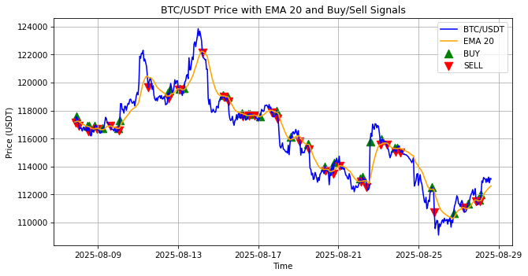

### Crypto EMA Trading Bot
    
A Python bot that uses **Exponential Moving Average (EMA)** for BTC/USDT trend-following trading.
    
This project demonstrates fetching historical cryptocurrency data, calculating EMA, generating buy/sell signals, backtesting, and visualizing trading results.
    
## Features
- Fetches live and historical BTC/USDT data using CCXT library
- Calculates EMA using Pandas library
- Generates **BUY / SELL / HOLD signals** based on trend-following logic
- Backtests strategy performance on historical data\n",
- Visualizes BTC price, EMA, and trade signals using Matplotlib library
---
## Installation\n",
1. Clone the repository:\n",
git clone https://github.com/Aantonjoe12/EMA_Trend_Following\n",
cd EMA_Trend_Following\n",
2. Install dependencies:\n",
   pip install -r requirements.txt 
---
## Usage
   
1. Run the Python script: python Trend_Following.py\n",
    
2. Or open the Jupyter Lab to run the code interactively: jupyter lab Trend_Following.ipynb\n",

3. The bot will fetch BTC/USDT data, calculate EMA, generate signals, backtest the strategy, and plot results.\n",
 
 
## Example Plot
The plot below is automatically generated by the bot and saved as `screenshot.png`.\n",

    
- Blue line: BTC/USDT closing price\n",
- Orange line: EMA 20\n",
- Green triangles: BUY signals\n",
- Red triangles: SELL signals\n",
---
## Skills Demonstrated\n",
- Python programming\n",
- Data analysis with Pandas\n",
- API usage with CCXT\n",
- Technical indicators and trading logic\n",
- Backtesting trading strategies\n",
- Data visualization with Matplotlib\n",
 ---